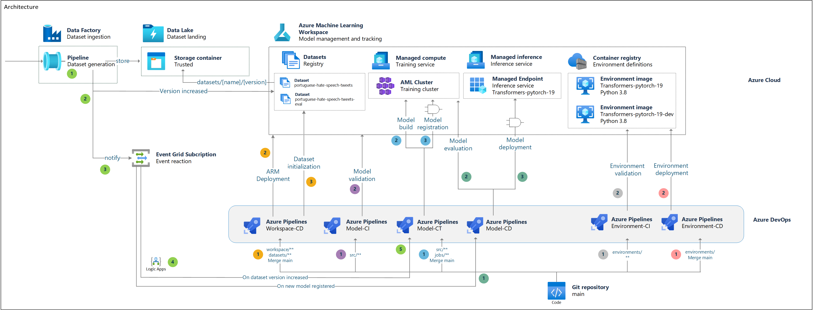

# MLOps
# Milestone Zero Immersion Workshop

## Description:
Create a Code-With Experience between partners and customer, driving in the best practices deploying a MLOps solution using trunk-based development, for understanding best practices of Machine Learning Operationalization and Software Engineering combined.​

## Benefits:​

**Automation**: Automated processes with a reduced lead time, delivering value faster and frequently.​

**Engineering Practices**: Land Agile and Software Engineering Practices contributing to maturity levels and impacting the Developer Velocity Index​.

**Knowledge Transfer**: Empowered and Skilled Developers and Engineers, leaving them with more confidence and knowledge to build solutions inside Azure.​

## Scope: ​

- DevOps​
- Infrastructure as Code​
- MLOps

## Target audience

- Software Engineers
- Data Engineers
- Data Architects

## Abstracts

### **Workshop Overview**

In this workshop, you will deploy a MLOps reference arquitecture. It demostrates how apply the worflow in a sample project along with a CI/CD implementation for Azure DevOps.

### **Lab Instructions**

1. Follow these [quickstart instructions](./quickstart/README.md) to setup your lab environment before starting the Hands-On Lab.

2. Follow the [Hands-On Lab instructions](./hands-on-lab/HOL%20step-by-step%20-%20DevSquad%20in%20a%20Day.md#).

## Azure services and related products

- Azure DevOps
- Azure Machine Learning
- Azure Data Lake Storage Gen2
- Azure Data Factory
- Azure Event Grid

## Help & Support

We welcome feedback and comments from Microsoft SMEs & learning partners who deliver this workshop.  

***Having trouble?***

- First, verify you have followed all written lab instructions (including the quickstart documents).
- Next, submit an issue with a detailed description of the problem.
- Do not submit pull requests. Our content authors will make all changes and submit pull requests for approval.

If you are planning to present a workshop, *review and test the materials early*! We recommend at least two weeks prior.

### Please allow 5 - 10 business days for review and resolution of issues.

## Trademarks

This project may contain trademarks or logos for projects, products, or services. Authorized use of Microsoft trademarks or logos is subject to and must follow [Microsoft's Trademark & Brand Guidelines](https://www.microsoft.com/en-us/legal/intellectualproperty/trademarks/usage/general).
Use of Microsoft trademarks or logos in modified versions of this project must not cause confusion or imply Microsoft sponsorship.
Any use of third-party trademarks or logos are subject to those third-party's policies.
