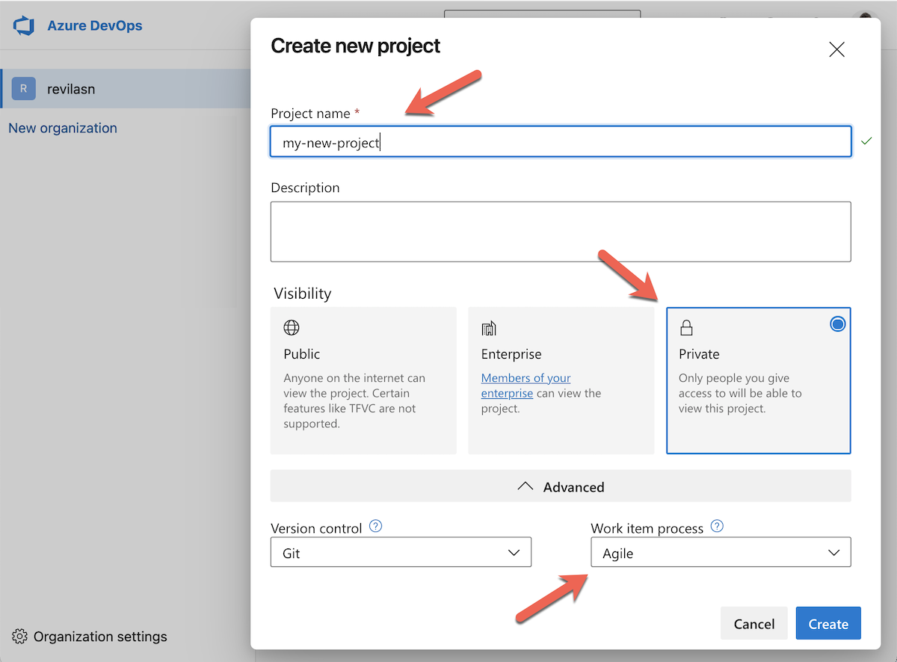
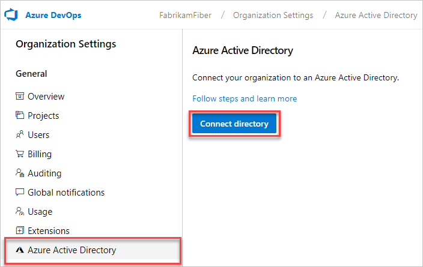
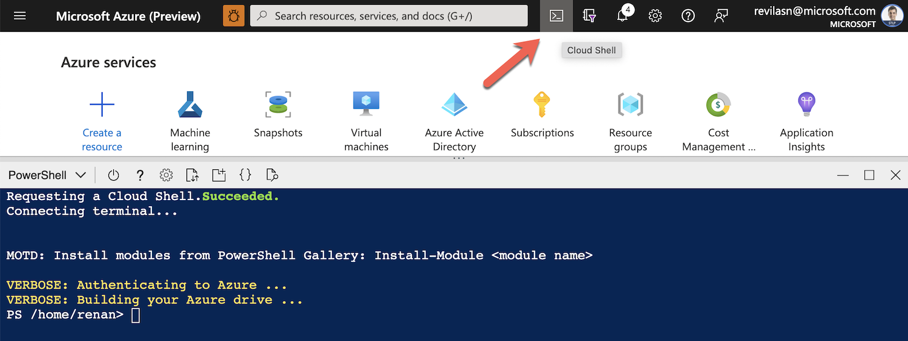
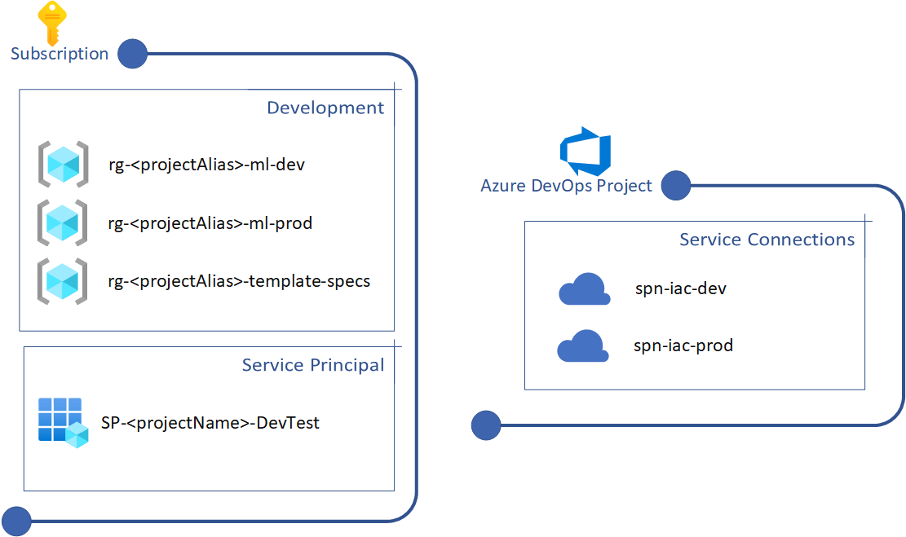

# Setup the Hands-On Lab

Execute all these steps below to setup your evironment before running the Hands-On Lab.

## Step 1: Azure DevOps Setup

1. Create a new [Azure Azure DevOps Project](https://docs.microsoft.com/en-us/azure/devops/organizations/projects/create-project?view=azure-devops&tabs=preview-page).

    - **Visibility:** `Private`

    - **Work item process:** `Agile`

    

2. [Install the GitTools extension](https://marketplace.visualstudio.com/items?itemName=gittools.gittools&targetId=0d8e54d4-e229-47bd-9dc5-9be0f116a5c0&utm_source=vstsproduct&utm_medium=ExtHubManageList) in the Organization level of the new Azure DevOps project.

    

3. Authorize the project **Build Service** to be an Administrator of Variable Groups:

    - Select **Library** under **Pipelines**:

        

    - Click the **Security** button:

        

    - Make sure the **Build Service** has the **Administrator** role:

        

        > In case the Build Service user is not present on this list, click on `+ Add` and search for `<projectName> Build Service`, assigning the `Administrator` role.
        > If you aren't finding the `<projectName> Build Service`, start typing your project name on the search bar, and you should receive a suggestion for `<projectName> Build Service`.

4. Make sure the Organization where the project is created in the Azure DevOps is [connected with the Azure Active Directory](https://docs.microsoft.com/en-us/azure/devops/organizations/accounts/connect-organization-to-azure-ad?view=azure-devops) of the Azure Subscription that will be used in the lab.

    - Select your Azure DevOps organization and open the `Organization Settings` menu:

        

    - On the `Organization Settings` menu, navigate to `Azure Active Directory` and check if your Azure DevOps organization is already connected to an Azure AD. *If it is not*, press the `Connect directory` button and configure it with your Azure subscription.

        

    - On the `Organization Settings` menu, navigate to `Parallel jobs` and check if you have `Micsoft-hosted` agents for private projects, non zero. *If it is not*, press the `Change` button and `Setup billing` and change the number of parallel jobs.

     

## Step 2: Setup the Hands-On Lab configuration file

1. Open the [Azure Cloud Shell](https://shell.azure.com) and select the **PowerShell** option.

    > When using the Azure Cloud Shell, be sure you are logged in Azure with the subscription you want to use for the hands-on lab.

    > If it's the first time you are using Azure Cloud Shell, you will be prompted to create an Azure Storage. Proceed with that storage creation with default values.

    

2. **Update Az.Resource to the last version**

    The quickstart scripts needs the lastest version of `Az.Resources` library installed. To update your powershell library on the console with the last version of the lib use the command bellow (It will automatically check if te update is needed or not):

    ```Install-Module -Name Az.Resources -Force```

3. **On the Azure PowerShell terminal:** clone the source code of the lab and go to the `hol` directory.

    ```powershell
    git clone https://github.com/microsoft/gps-data_ai-devsquad-mlops.git mlops-hol
    
    cd mlops-hol
    ```

4. **On the Azure PowerShell terminal**: execute the following command to create a new config file based on an existing template. Provide arguments to this setup based on the table below:

    ```powershell
    # Be sure to execute this script under the hol directory
    ./quickstart/scripts/cloud-setup/Replace-TemplateArgs.ps1
    ```
    
    > **Don't use the default parameters from the table below!** You will need to use your own Azure DevOps organization name, Azure DevOps project name and Azure subscription ID. The alias can be any randomized alphanumerical string with **less than 8 characters**.

    |Argument|Description|Example|
    |-----|-----------|-------|
    |<_orgName_>|Azure DevOps organization name where you will execute the Hands-On Lab|_org-dataops_|
    |<_projectName_>|Name of the existing project inside Azure DevOps where you will execute the Hands-On Lab|_project-dataops_|
    |<_subscriptionId_>|Azure Subscription ID where the resources will be deployed|_f7e5bb9e-0f98-4c5d-a5c1-a9154bf3cd61_|

- (_OPTIONAL_) If you are using this project as a Hands-On Lab, feel free to proceed to the next step of the lab setup. If you are using this project as a template for dataops, check [this additional documentation](./docs/0b-prerequisites-advanced.md) that explains advanced configuration options.


## Step 3: Deploy Azure Resources in your subscription

1. Generate a Personal Access Token (PAT) on Azure DevOps.

    - An environment variable called `AZURE_DEVOPS_EXT_PAT` that stores a [PAT (Personal Access Token)](https://docs.microsoft.com/en-us/azure/devops/organizations/accounts/use-personal-access-tokens-to-authenticate?view=azure-devops&tabs=preview-page) with **Full Access** is required to allow the next script to connect to the new Azure DevOps project and deploy all the resources.

    - To do so, create the PAT on your new Azure DevOps project then run the following command **on the Azure PowerShell terminal**:

        ```powershell
        $env:AZURE_DEVOPS_EXT_PAT="<my PAT goes here>"
        ```

2. Run the deployment script

    -  **On the Azure PowerShell terminal**: run the `Deploy-AzurePreReqs.ps1` script to deploy the pre-required Azure resources:

        ```powershell
        az config set extension.use_dynamic_install=yes_without_prompt
        Connect-AzureAD
        ./quickstart/scripts/cloud-setup/Deploy-AzurePreReqs.ps1 -ConfigurationFile "quickstart/configs/cloud-setup/hol.json"
        ```

    - The diagram below shows what Azure resources will be created after the execution of the script.

        

## Step 4: Prepare your Azure DevOps project

1. Create an Artifact Feed

    -  An artifact feed is required on the lab for publishing Python libraries with versioning.
    
    - On your Azure DevOps project, go to the `Artifacts` section -> `Create Feed`, then set the name as `lib-packages`:

        

2. Azure DevOps project setup

    - **On the Azure PowerShell terminal**: run the command below.

        ```powershell
        # You don't need to change any of the following values below
        git config --global user.email "hol@microsoft.com"
        git config --global user.name "HOL Setup User"
        ```

        > This command configures git and defines an environment variable that will be used to setup your Azure DevOps project.

    - **On the Azure PowerShell terminal**: run the following script to clone the `hol` repo, create the pipelines and service connections inside your new Azure DevOps.

        ```powershell
        ./quickstart/scripts/dataops/Deploy-AzureDevOps.ps1 -ConfigurationFile "./quickstart/outputs/hol.json" -UsePAT $true
        ```

        >  Note the file name is the one inside the output directory and the name is the same name of the _projectName_ that was replaced in the first config file.


3. (Optional) If you are using this project as a Hands-On Lab, feel free to proceed to the next step of the lab setup.

## Step 5: Create the Hands-On Lab VM

1. Deploy a pre-configured VM that contains all the tools required for executing the Hands-On Lab.

    - **On the Azure PowerShell terminal**: run `Deploy-LabVM.ps1`.
    
        ```powershell
        ./quickstart/scripts/labvm/Deploy-LabVM.ps1
        ```


2. Access the VM resource and assign a new password to the user `labuser`.
    
    

    - Feel free to create any password of your preference, or to use the suggestion below:

        - **Username:** `labuser`

        - **Password:** `Password.1!!`

3. Connect to the VM using a RDP client:

    

    > Note that the RDP port of the VM is already configured to allow inbound access.


## Hands-On Lab

- *Before* starting the Hands-On Lab, you should follow all the steps provided on this quickstart tutorial.

- For starting the Hands-On Lab, follow [these instructions](../hands-on-lab/HOL%20step-by-step%20-%20DevSquad%20in%20a%20Day.md#).
